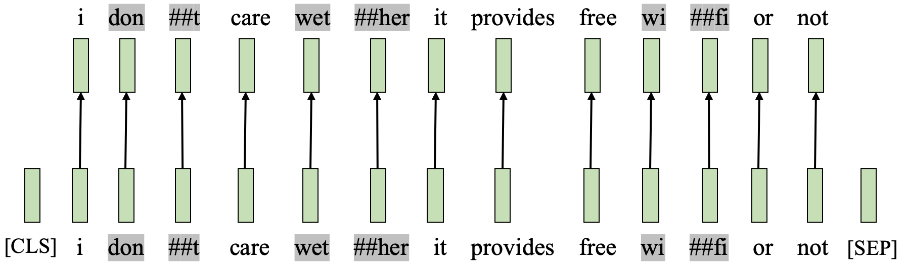
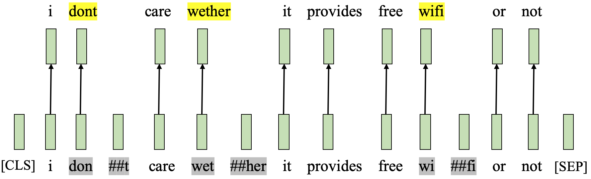
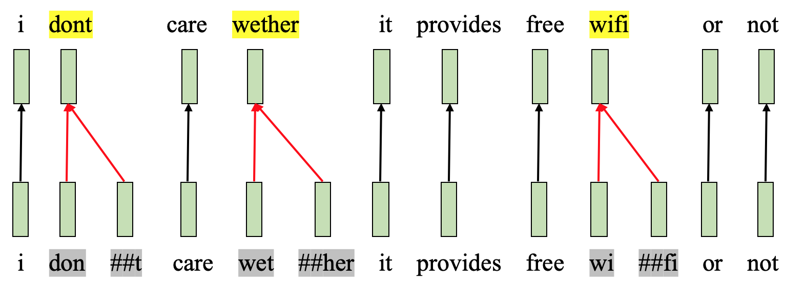

# pretrained_word_embeddings
It is about how to load pretrained word embeddings in pytorch, e.g., ELMo\BERT\XLNET.

## Setup
 * python 3.6.x
 * [pytorch](https://pytorch.org/) 1.3.1
 * pip install gpustat     [if gpu is used]
 * [ELMo in allennlp](https://github.com/allenai/allennlp): pip install allennlp
 * [BERT/XLNET in transformers](https://github.com/huggingface/transformers): pip install transformers
 
## Use

```
python elmo_bert_xlnet_layer.py
```

## Alignment from BERT\XLNET tokens to original words

Usually, we want to get word embeddings from BERT\XLNET models, while one word may be split into multiple tokens after BERT\XLNET tokenization. In this case, we would like to get word embeddings by using the alignment from BERT\XLNET tokens to original words.

For example, the sentence 
```
"i dont care wether it provides free wifi or not"
```
can be tokenized as 
```
['i', 'dont', 'care', 'wet', '##her', 'it', 'provides', 'free', 'wi', '##fi', 'or', 'not']
```
.

We provide three types of alignment:
  * 'ori': we simply use the output embeddings of BERT\XLNET to represent each input sentence, while ignoring the output embeddings of special tokens like '\[CLS\]' and '\[SEP\]'.
  * 'first': using the embedding of the first token of each word as the word embedding.
  * 'avg': averaging the embeddings of all the tokens of each word as the word embedding.
  

### 1. alignment is 'ori'

 

### 2. alignment is 'first'

 

### 3. alignment is 'avg'

 
